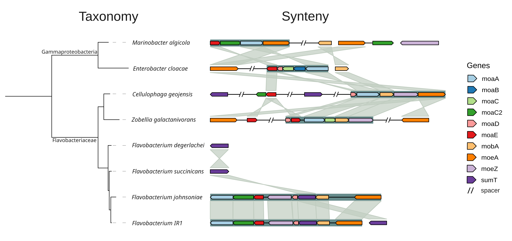

# Visualizing Synteny and Homology of Genes

This repository contains a tutorial and scripts to create a gene synteny and homology figure for a set of species. 

<p align="center">
  
</p>

# Required software

If you have access to the draco high-performance cluster and are part of the VEO group, you only need to install gggenomes and Rstudio locally in your computer for creating the synteny and homology figure. Additionally, Inkscape is a good option to do final touches, which you could also install locally. The other software are already installed in draco and can be used as mentioned in this tutorial. In other cases, you should install the following software as well according to the developer's recommendations:   

For synteny and homology figure:  

- [gggenomes](https://github.com/thackl/gggenomes)
- [Rstudio](https://posit.co/download/rstudio-desktop/)
- [Prodigal](https://github.com/hyattpd/Prodigal) 
- [BLAST](https://ftp.ncbi.nlm.nih.gov/blast/executables/blast+/LATEST/)
- [python3](https://www.python.org/downloads/) 
- [Jupyter notebook](https://jupyter.org/install)
  
To create a taxonomy tree:

- [Barrnap](https://github.com/tseemann/barrnap)
- [BEDtools](https://bedtools.readthedocs.io/en/latest/index.html)
- [MAFFT](https://mafft.cbrc.jp/alignment/software/installation_without_root.html)
- [iqtree](http://www.iqtree.org/)
  
For final touches:

- [Inkscape](https://wiki.inkscape.org/wiki/Installing_Inkscape)

# Synteny and homology figure

To start, log in to draco, and allocate a node to work on, clone this repository and move to the repository folder:

```
ssh <fsu_id>@login2.draco.uni-jena.de
salloc --partition=standard 
git clone https://github.com/MGXlab/genes_synteny.git
cd genes_synteny
```

As input, you should have FASTA files with genomes (as the files in genomes/ in this repository). If you already have proteins in FASTA and BED or GFF formats, you can skip the next steps. If you do not have proteins yet, predict genes with Prodigal with the script ```scripts/prodigal.sh```, as indicated below. If you already have proteins of interest, you can BLAST them to other genomes's gene predictions to get the homology using script ```scripts/blast.sh```. After you have the coordinates of the proteins of interest produced by BLAST, you can adapt their format to be compatible to gggenomes using script ```scripts/get_coordinates.py``` (the object will be a file called alv_genes.csv). The usage of this script follows below with an example file given in this repository. You can run this script for all files within a folder using script ```scripts/get_coordinates.sh``` as below.

```
#Run Prodigal
bash scripts/prodigal.sh
#Run BLAST

#Optional: run get_coordinates.py just for one file
python3 scripts/get_coordinates.py genomes/ZONMW-30.blastoutbest genomes/ZONMW-30.gff > alv_genes_SPECIES.csv
#Run get_coordinates.py for all files
bash scripts/get_coordinates.sh > alv_genes_ALL_SPECIES.csv
```

The jupyter notebook ```scripts/get_objects.ipynb``` creates the other objects necessary for gggenomes:

- alv_seqs: contains sizes of genomes
- alv_ava: contains homologies between genomes
- alv_prot_ava: contains homologies between ortholog proteins

The object alv_operons is optional for gggenomes and indicates operon coordinates. It was written by hand for the files given in this repository based on biological knowledge of the proteins related to the phenotype of interest.   

After you create all objects, you can visualize them with gggenomes in RStudio using script ```scripts/synteny.r```.   

# Taxonomy tree

To create a taxonomy tree of your species of interest, you start with extracting 16S rRNA genes from the genomes of the bacteria using Barrnap. This can be done with script ```scripts/barrnap.sh```, which also uses BEDtools getfasta to extract the FASTA sequences (the output of Barrnap is GFF files with coordinates). It may be that more than one 16S rRNA gene is predicted, so you should choose one copy for the subsequent steps. Concatenate all 16S files for the individual species using the bash command below:

```
cat 16S_genes/*fasta > 16S_genes/all_species_16S.fasta
```

The next step is to align the 16S rRNA genes with MAFFT using the command below. The command for iqtree is also given below, but you could run it with an sbatch script as an alternative (```scripts/iqtree.sbatch```).

```
/home/groups/VEO/tools/mafft/v7.505/bin/mafft all_16S.fasta > all_16S.alg
/home/groups/VEO/tools/iqtree/1.6.12/bin/iqtree -s 16S_gene/all_16S.alg
```

iqtree produces a taxonomy tree in Newick format, which you could visualize in RStudio (script ```scripts/synteny.R```) or alternatively in the online tool [iToL](https://itol.embl.de/).   

Any final touches to the figures can be done using Inkscape.
